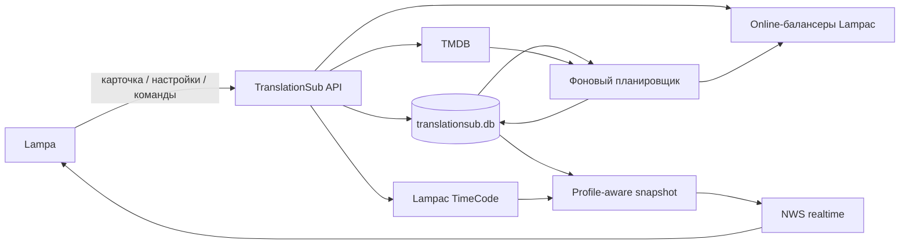

<div align="center">

# 🎙️ TranslationSub

**Подписки на конкретные озвучки сериалов для Lampa + Lampac**

Следит не просто за выходом новой серии, а за тем, появилась ли она **именно в выбранной озвучке**.

[](https://github.com/lampac-nextgen/lampac)


[](https://www.themoviedb.org/)
[](https://www.sqlite.org/)

[](../../LICENSE)

[Быстрый старт](#quick-start) •
[Возможности](#features) •
[Интерфейс](#interface) •
[Настройки](#settings) •
[Как работает](#how-it-works) •
[API](#api)

</div>

<p align="center">
  
  <br>
  <sub>Подписки на озвучки: сезон, просмотренная серия, доступная серия, источник и состояние TMDB</sub>
</p>

> [!NOTE]
> TranslationSub работает с **сериалами**. Фильмы в подписки на озвучки не добавляются.

---

<a id="features"></a>

## ✨ Возможности

- 🎙️ **Подписка на конкретную озвучку** прямо из карточки сериала.
- 🔎 **Поиск озвучек через Online-балансеры Lampac** с выбором источников в настройках.
- 🧩 **Объединение одинаковых озвучек** из нескольких балансеров в один вариант.
- 📺 **Отдельная страница подписок** с постером, сезоном, просмотренной и доступной серией.
- 🔔 **Уведомления о продолжении** и бейдж количества новых серий в интерфейсе Lampa.
- ⚡ **Realtime через NWS** — интерфейс получает изменения без ручного обновления страницы.
- 🗓️ **Умное расписание TMDB** — балансеры не опрашиваются раньше фактического выхода серии.
- 🔄 **Поддержка новых сезонов**: продолжать автоматически, только уведомлять или не отслеживать.
- ▶️ **Синхронизация с Lampac TimeCode** с отдельным прогрессом для каждого профиля Lampa.
- 💾 **SQLite-хранилище** для подписок, настроек, расписания и профильной проекции прогресса.
- 🧷 **Автоподключение клиента** — вручную добавлять URL JS-плагина в Lampa не требуется.

---

<a id="interface"></a>

## 🖼️ Интерфейс

### 🔔 Уведомления

<p align="center">
  
  <br>
  <sub>Новые серии собираются в одном окне; оттуда можно перейти к подпискам или открыть нужный сериал</sub>
</p>

<details>
<summary>⚙️ <b>Настройки и выбор балансеров</b></summary>

<br>

<table>
  <tr>
    <td width="50%" align="center">
      
      <br><sub>Интервалы, TMDB, новые сезоны и перепроверка</sub>
    </td>
    <td width="50%" align="center">
      
      <br><sub>Online-балансеры Lampac, участвующие в поиске озвучек</sub>
    </td>
  </tr>
</table>

</details>

---

<a id="quick-start"></a>

## 🚀 Быстрый старт

**1. Модуль уже находится в `Modules/TranslationSub` этой ветки Lampac и автоматически попадает в `module/TranslationSub` при публикации.**

Итоговая структура:

```text
Modules/
└── TranslationSub/
    ├── manifest.json
    ├── ModInit.cs
    ├── V2Controller.cs
    ├── Models/
    ├── Services/
    ├── translationsub.js
    └── ...
```

Модуль помечен в `manifest.json` как динамический:

```json
{
  "enable": true,
  "dynamic": true
}
```

**2. При необходимости добавьте серверную секцию в `init.conf`:**

```json
"TranslationSub": {
  "enable": true,
  "check_interval_minutes": 15,
  "tmdb_apihost": "https://api.themoviedb.org/3"
}
```

**3. Загрузите или перезапустите модуль штатным способом вашей сборки Lampac.**

> [!IMPORTANT]
> Отдельно подключать `/translationsub.js` в Lampa **не нужно**. При включённом модуле Lampac автоматически добавляет клиентский скрипт в приложение через `EventListener.AppReplace`.

> [!TIP]
> `check_interval_minutes` — частота фонового прохода серверного планировщика. Это **не** пользовательский интервал активной проверки озвучек в Lampa.

---

<a id="settings"></a>

## ⚙️ Настройки

Основные параметры задаются прямо в Lampa:

| Параметр | По умолчанию | Диапазон / варианты | Что делает |
|---|---:|---|---|
| Интервал активного опроса | 1 час | 1–24 часа | Как часто проверять озвучку, когда серия уже вышла, но ещё не найдена |
| Умное расписание TMDB | Включено | Да / Нет | Не опрашивать балансеры до фактического выхода серии или сезона |
| Обновление расписания TMDB | 24 часа | 6–168 часов | Как часто обновлять TMDB-данные активных сериалов |
| Перепроверка завершённых сериалов | 7 дней | 1–90 дней | Редкая актуализация сериалов со статусом завершён |
| Новый сезон | `auto` | `auto`, `notify`, `off` | Что делать при старте следующего сезона |
| Балансеры | Не выбраны | Доступные Online-модули Lampac | Какие источники использовать для поиска озвучек |

> [!TIP]
> При включённом **умном расписании TMDB** модуль может не трогать Online-балансеры до даты выхода следующей серии. Это уменьшает лишние запросы к источникам.

<details>
<summary>🆕 <b>Режимы нового сезона</b></summary>

<br>

| Режим | Поведение |
|---|---|
| `auto` | Автоматически продолжить подписку на следующий сезон |
| `notify` | Показать, что новый сезон уже начался |
| `off` | Не отслеживать переход на новые сезоны |

</details>

<details>
<summary>🛠️ <b>Серверные параметры Lampac</b></summary>

<br>

| Параметр | По умолчанию | Назначение |
|---|---:|---|
| `enable` | `true` | Включить или выключить модуль |
| `check_interval_minutes` | `15` | Частота фонового прохода планировщика |
| `tmdb_apihost` | `https://api.themoviedb.org/3` | API host TMDB |
| `tmdb_apikey` | встроенное значение | При необходимости можно переопределить ключ TMDB в конфигурации |

</details>

---

<a id="how-it-works"></a>

## 🧠 Как это работает



1. **Lampa открывает карточку сериала.** Lampac определяет идентификаторы контента на сервере.
2. **TranslationSub запрашивает выбранные Online-балансеры** и получает доступные варианты озвучки.
3. **Одинаковые названия нормализуются и объединяются**, поэтому одна озвучка не дублируется только из-за разных источников.
4. **Подписка сохраняется в SQLite** вместе с найденными источниками и состоянием отслеживания.
5. **TMDB задаёт расписание.** Если серия ещё не вышла, активный опрос балансеров можно отложить.
6. После даты выхода модуль **проверяет выбранную озвучку** и обновляет доступный эпизод.
7. **TimeCode** синхронизирует просмотренную серию для текущего профиля.
8. При изменениях **NWS отправляет `TranslationSubChanged`**, после чего клиент получает свежий snapshot.

<details>
<summary>🎙️ <b>Почему одна озвучка может иметь несколько источников</b></summary>

<br>

Название озвучки нормализуется на сервере. Если одна и та же озвучка найдена, например, в нескольких Online-балансерах, TranslationSub хранит её как один логический вариант, но помнит доступные источники.

Так пользователь подписывается на **озвучку**, а не на конкретный балансер.

</details>

---

## 💾 Хранение и прогресс

Собственное состояние TranslationSub находится в:

```text
database/translationsub.db
```

В базе хранятся:

- пользовательские настройки;
- подписки и источники озвучек;
- состояние TMDB и фонового планировщика;
- профильная проекция просмотренных эпизодов.

Источник фактического прогресса просмотра — штатный Lampac TimeCode:

```text
database/TimeCode.sql
```

> [!NOTE]
> Для TranslationSub эпизод считается просмотренным при прогрессе TimeCode **от 60%**. Прогресс проецируется отдельно для каждого профиля Lampa и не смешивается с общей метаинформацией подписки.

---

## ⚡ Realtime

Клиент регистрирует текущие `uid` и `profile_id` через Lampac NWS.

При изменении подписки или после успешной синхронизации TimeCode сервер публикует событие:

```text
TranslationSubChanged
```

Клиент обновляет snapshot и бейджи. После потери соединения realtime-клиент переподключается и заново регистрирует активный профиль.

---

<a id="api"></a>

## 🔌 API

<details open>
<summary><b>Основные endpoints</b></summary>

<br>

| Метод | Endpoint | Назначение |
|---|---|---|
| `GET` | `/translationsub/v2/snapshot` | Состояние подписок для текущего профиля |
| `POST` | `/translationsub/v2/content-state` | Состояние карточки и список озвучек |
| `POST` | `/translationsub/v2/subscriptions` | Создать подписку |
| `POST` | `/translationsub/v2/subscriptions/{id}/remove` | Удалить подписку |
| `POST` | `/translationsub/v2/check` | Принудительно проверить новые серии |
| `GET` / `POST` | `/translationsub/v2/settings` | Получить или изменить настройки |
| `GET` | `/translationsub.js` | Клиентский плагин Lampa |

</details>

---

## 🗂️ Структура модуля

<details>
<summary><b>Показать структуру</b></summary>

<br>

```text
TranslationSub/
├── Models/                    # модели подписок, snapshot и metadata
├── Services/                  # SQLite, TMDB, TimeCode, балансеры, scheduler, NWS
├── ModInit.cs                 # жизненный цикл модуля и автоподключение клиента
├── V2Controller.cs            # основной API
├── SettingsController.cs      # пользовательские настройки
├── PluginController.cs        # сборка/выдача клиентского JS
├── manifest.json              # dynamic module manifest
├── translationsub.js          # runtime/bootstrap Lampa
└── translationsub-*.js       # UI, API, уведомления, настройки и realtime
```

</details>

## 🧩 Зависимости

- **[Lampac](https://github.com/lampac-nextgen/lampac)** с поддержкой dynamic modules и Online-балансеров;
- **Lampa** — пользовательский интерфейс;
- **TMDB** — расписание и сведения о выходе эпизодов;
- **Lampac TimeCode** — источник просмотренного прогресса;
- **Lampac NWS** — realtime-обновления;
- **SQLite** — локальное состояние TranslationSub.

## 📄 Лицензия

В составе Lampac NextGen модуль поставляется под условиями корневой лицензии **AGPL-3.0**. См. [`LICENSE`](../../LICENSE).

---

<div align="center">

TranslationSub — самостоятельный модуль для **[Lampac NextGen](https://github.com/lampac-nextgen/lampac)**.

</div>
